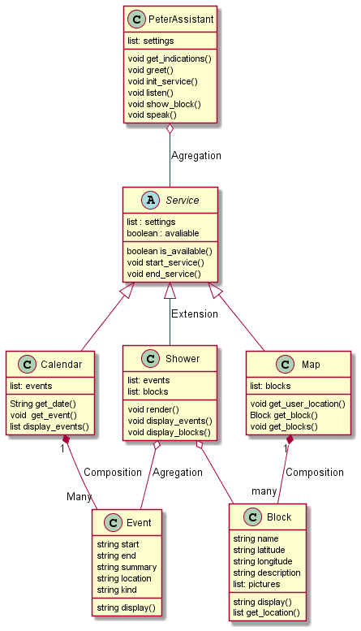

# Final-Project-OOP

## Funcionality requirements

- Authentication of users belonging to the Uninorte organization.
- Access to the user's academic calendar.
- The program must obey the user's orders, which will be given by means of a voice in Spanish.

### Diagram UML

## How to use PetterAssistent

- You must download or clone this repository, you also must have installed Python 3.10 in order to be able to execute the program.

* You must intall the next dependencies

  * SpeechRecognition 3.8.1
  * pyttsx3 2.90
  * PyAudio v0.2.11
  * pytz
  * google-api-python-client 2.45.0
  * google-auth 2.6.5
* For that, you can execute the next comand:

  `pip install SpeechRecognition pyttsx3 PyAudio pytz google-auth google-api-python-client`
* Once you have the code and the dependecies have been installed you can try the program by executing the file main.py which is in the src folder
