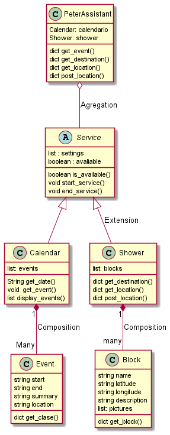

# Peter assistant

## What is Peter assistant?

Many first semester students find it difficult to learn their schedule or often forget what class or meeting they have at the moment and resort to search through their gallery with thousands of images that contains their schedule or open the Uninorte.co application that requires biometric authentication to view the schedule and that often like many other things that require biometric authentication access can become a bit complicated if you have your finger sores a little wet or the fingerprint sensor is not in good condition. In addition these students often do not know how to get to the room where they have their respective class and many of them are embarrassed to ask where they have to go and take a long time looking for the block where the room is.

Peter assistant is a virtual assistant that you can ask what class or meeting you have coming up next and it will tell you the time it starts, the time it ends, the name of the class and the location where it will take place. You can also see on a map how far or close the block you need to go to is to your location in real time.

## Funcionality requirements

- Authentication of users belonging to the Uninorte organization.
- Access to the user's academic calendar.
- The program must obey the user's orders, which will be given by means of a voice in Spanish.
- Display on screen and announce to the user which class is coming up.

### Diagram UML

## How to use PeterAssistant

- In order to try Peter Assistant you have to enter to the its home page in the next [link](https://no-invita.github.io/Peter-assistant-frontend/)
- You have to click on Peter to active the program
- Log in with your Google account.
- It deploys your classes.

---

you will find frontend interface develop started in the next [repository](https://github.com/No-Invita/Peter-assistant-frontend) or in our another [branch](https://github.com/No-Invita/Final-Project-OOP/tree/gh-pages)
